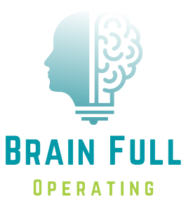
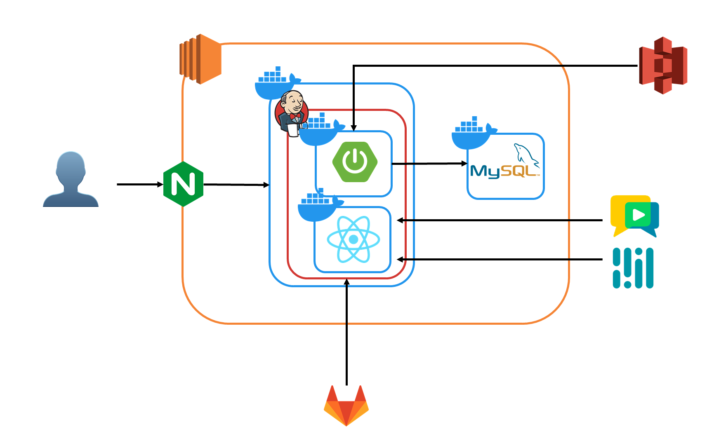
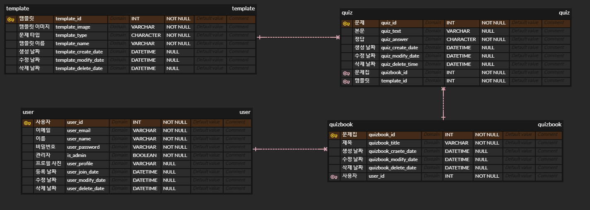

   
  
   

 <h3><b>BFO</b></h3>
    mediapipe를 활용한 동작 인식 기술로,  
    오프라인에서는 경험할 수 없는 새로운 형태의 에듀테인먼트 경험을 제공하는  
    화상 기반 레크리에이션 플랫폼 
   삼성 청년 SW 아카데미</b>  
  2023.07.04 ~ 2023.08.18
   
  <a href="https://youtu.be/DZ6Z-Z0OtKA"> 
     
    UCC 보러가기
  </a>

# 👨‍👩‍👧‍👦 멤버

<table>
    <tr>
        <td height="140px" align="center"> <a href="https://github.com/Headfish96">
                👑 허준영  (Front-End) </a>  </td>
        <td height="140px" align="center"> <a href="https://github.com/pockypepe">
                🌊 송혁준  (Back-End) </a>  </td>
        <td height="140px" align="center"> <a href="https://github.com/c0mmedes">
                🔥 정내혁  (Front-End) </a>  </td>
        <td height="140px" align="center"> <a href="https://github.com/hyo-nu">
                🌞 정의민  (Back-End) </a>  </td>
        <td height="140px" align="center"> <a href="https://github.com/KyungWon96">
                👻 주영인  (Front-End) </a>  </td>
        <td height="140px" align="center"> <a href="https://github.com/ejuun">
                🌙 홍지민  (Back-End) </a>  </td>
    </tr>
</table>

 

# ⚙️ 아키텍쳐 및 기술 소개

<table>
    <tr>
        <td><b>Back-end</b></td>
        <td>
            
            
            
            
            
            
        </td>
    </tr>
    <tr>
        <td><b>Front-end</b></td>
        <td>
            
            
            
            
            
            
        </td>
    </tr>
    <tr>
        <td><b>Infra</b></td>
        <td>
            
            
            
            
            
        </td>
    </tr>
    <tr>
        <td><b>VC</b></td>
        <td>
            
            
            
              
        </td>
    </tr>
    <tr>
        <td><b>Tools</b></td>
        <td>
            
            
            
        </td>
    </tr>
</table>

 

# 🪓 시스템 아키텍처

## BFO (Brain Full Operating)

  
 

# 📚 ERD

### Billage (Main Service)

 

# 💻 기능 소개

## 회원가입

 

- Billage는 본인 인증을 기반으로 한 서비스이기에 이름과 등록된 핸드폰 번호를 통한 본인 확인을 실시합니다.
- 본인 인증이 된 후 앞으로의 편리한 서비스 사용을 위해 간편 비밀번호를 등록합니다.
- 간편 비밀번호는 4자리 숫자와 1자리 문자(or 특수문자) 총 5글자로 구성되며, 앞으로의 서비스 사용에서 로그인,이체, 계좌에서 사용됩니다.
   

## 로그인

  \*기존에 가입 한 휴대폰 번호와 간편 비밀번호를 통해 로그인을 할 수 있습니다.
 

## 게임방 생성

 

### 게임 참여

- Billage 프로젝트에서는 가상의 은행을 구축하였습니다.
- Billage 서비스에서는 본인 인증을 통한 마이데이터 서비스를 통해 각 은행에 있는 계좌들을 확인 할 수 있습니다.
- 등록 하고싶은 계좌를 복수 선택한 뒤 간편 비밀번호 확인을 통해 계좌 등록을 실시 할 수 있습니다.

## 게임

### 모양 맞추기

- 내 계좌 목록에 있는 계좌들 중 주 계좌로 등록하고 싶은 계좌를 클릭을 하게되면 ‘주 계좌로 등록하시겠습니까?’ 라는 모달창과 함께 ‘네’를 클릭할 시 계좌 테두리가 굵은 연두색으로 표시됩니다.

 

## 3지선다

 

- “거래하기” 버튼을 눌러서 차용증 작성으로 넘어갈 수 있습니다.
- “차용증 작성” 으로 들어가면 “지인 선택”에서 채무자가 채권자를(돈을 빌릴 사람을) 선택할 수 있다.
- 이름을 입력하면 해당 이름과 같은 사람들 중에 전화번호 뒷 4자리로 구분하여 선택할 수 있다.
- 돈 받을 계좌는 사전에 채무자가 설정한 대표 계좌로 설정되어 있으나 이는 변경이 가능합니다.
- 돈 갚을 상환일을 채권자가 선택할 수 있습니다.
- 빌릴 금액은 직접 입력도 가능하지만 버튼을 통해 간편 입력도 가능합니다.
- 이자율은 법정 이자율을 넘지 않는 선에서 채무자가 선택합니다.
- 총 상환 금액까지 확인한 후 작성완료를 누르면 차용증이 작성되어 보여집니다.
- 체크박스를 통해 중복 확인을 합니다.
- 요청하기를 눌러 채권자에게 돈 빌리기를 요청한다.
- 거래 목록에 가면 채권자의 답을 기다리고 있는 회색의 목록을 확인할 수 있습니다.
- 거래를 누르면 해당 거래에 대한 상세정보를 확인할 수 있습니다.
   

## 등수채점

 

- 거래목록 화면에선 현재 진행중이거나, 요청 대기중인 거래들을 확인할 수 있습니다.
- 진행중인 거래는 빌린금액과 이자를 포함한 총 금액 중 현재까지의 상환현황을 퍼센트로 보기 쉽게 확인할 수 있습니다.
- 해당 거래를 누르면 거래상세내용이 담긴 페이지로 이동해 거래에 관한 모든 정보를 확인할 수 있습니다.
- 차용증 버튼 클릭 시 거래정보를 차용증 문서 형식에 맞게 보여주며 해당 문서를 다운로드할 수 있습니다.
- 거래내역에선 해당 거래에서 채권자와 채무자간의 이체내역을 확인할 수 있습니다.

 
